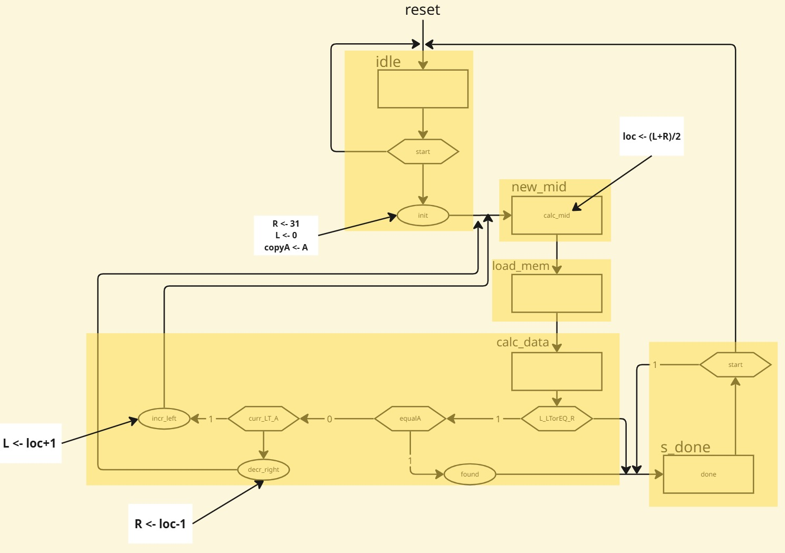
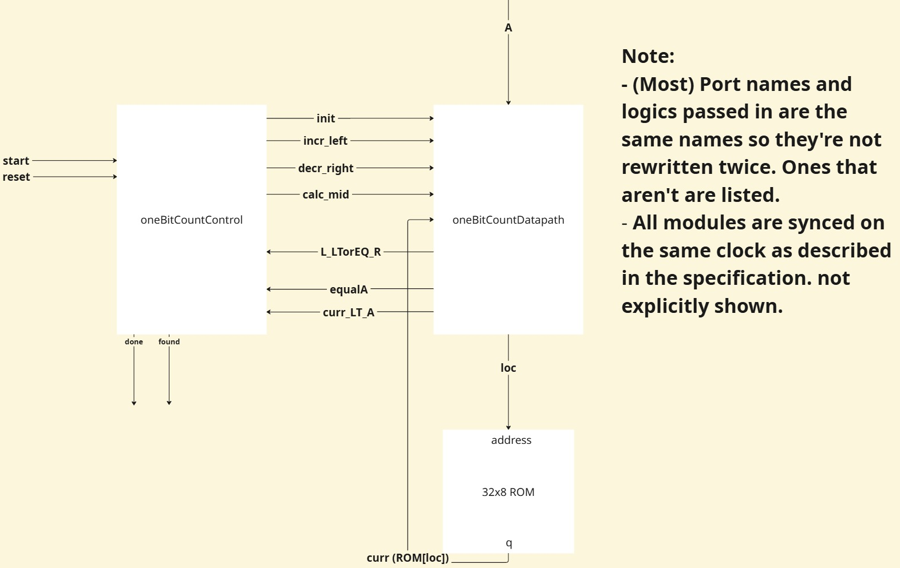

# Binary Search Implementation on an FPGA board:
This is an implementation of the Binary Search Algorithm coded in System Verilog to run on an FPGA board. The algorithm reads in a sorted 32x8 ROM containing unsigned 8-bit integers and returns a signal if our target is found within the ROM or not. An output signal indicating the search algorithm has been completed is also included. The code is organized via a top-level module of the algorithm, followed by a control-unit module for the FSM logic and a datapath module for operations and arithmetic on registers. The top level code file can be found in [binarySearch.sv](binarySearch.sv) while the controller file can be found in [binarySearchControl.sv](binarySearchControl.sv) along with the datapath in [binarySearchDatapath](binarySearchDatapath).

# ASMD of Binary Search Algorithm:

# Block Diagram of Binary Search Algorithm (Controller and Datapath Connections):

